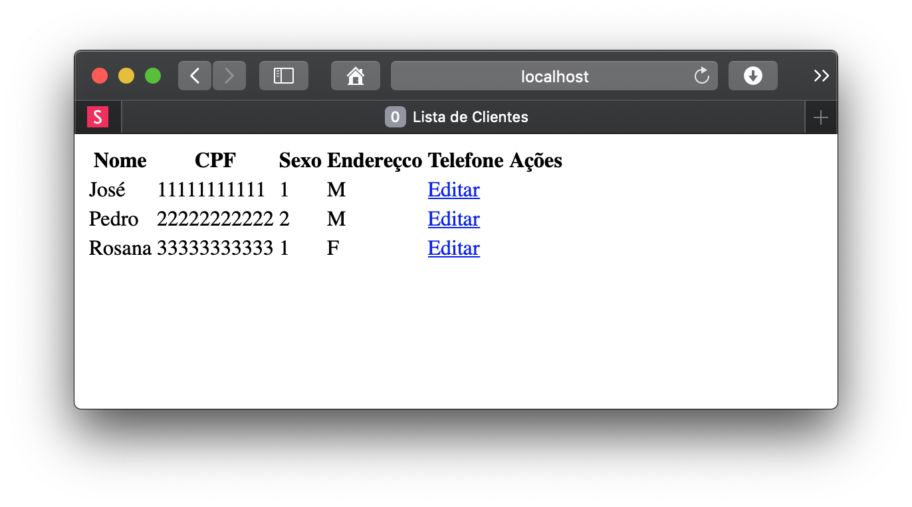

= Exemplos de problemas de concorrência (link:https://kinolien.github.io/gitzip/?download=/manoelcampos/sistemas-distribuidos/tree/master/projects/00-concorrencia/2-concorrencia-banco-dados-problema[zip])

Na seção https://manoelcampos.com/sistemas-distribuidos/book/chapter01c-transparency.html[Transparência de Concorrência"]
foram discutidos os problemas que podem ocorrer quando temos, por exemplo, vários usuários acessando o sistema.

Este projeto mostra tais problemas quando vários usuários tentar alterar um mesmo cadastro ao mesmo tempo. 

== Compilando e Executando o Projeto

O projeto requer o JDK 8 ou 11 instalado. 

A forma mais simples de compilar e executar este projeto é abrindo um terminal
na pasta raiz e executando o comando abaixo:

[source,bash]
----
mvn clean package
----

Após compilar, para executar basta digitar:

[source,bash]
----
mvn compile quarkus:dev
----

Após isto, basta abrir duas abas do navegador em http://localhost:8080.
A página inicial exibirá uma lista de clientes.
Clique no link "Editar" para alterar um mesmo cliente nas duas abas do navegador,
por exemplo, http://localhost:8080/cliente.html?id=1.
As duas abas funcionam como se tivessemos dois usuários alterando o cadastro do mesmo
cliente ao mesmo tempo.

Altere qualquer campo do cliente em uma das abas e clique no botão "Enviar".
Depois altere um outro campo do mesmo cliente na outra aba já previamente aberta.
Ao clicar em "Enviar" e depois recarregar a página para buscar novamente os dados do banco,
você verá que as alterações feitas na primeira aba terão sido substituídas
pelas alterações feitas na segunda aba.
Assim, os dados digitados pelo primeiro usuário terão sido perdidos.

O projeto link:../database-concurrency-jpa-solution[database-concurrency-jpa-solution]
mostra como resolver este problema de concorrência usando um recurso simples do framework JPA.
